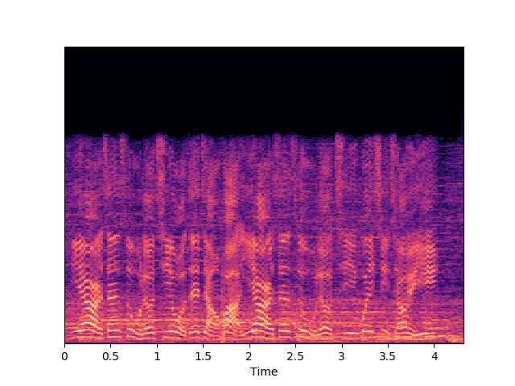
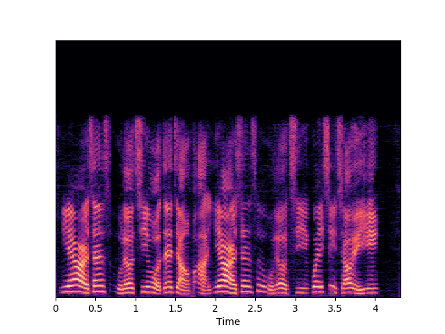

# PHASEN

---
Unofficial PyTorch implementation of MSRA's:
    [PHASEN: A Phase-and-Harmonics-Aware Speech Enhancement Network](https://arxiv.org/abs/1911.04697).
 

---

## My resutls on real-world test



Maybe there is something different with the paper, but it worked not bad.

---

## how to use it?
1. install dependency:
```bash
pip install -r requirements.txt

```
2. download datasets 

if you don't have WSJ0, you can follow this use aishell-1 by following this [se-cldnn-torch](https://github.com/huyanxin/se-cldnn-torch) 

### Attetion
There is something different from [se-cldnn-torch](https://github.com/huyanxin/se-cldnn-torch):
the two list for train (tr.lst, cv.lst ...) need duration information, but [se-cldnn-torch](https://github.com/huyanxin/se-cldnn-torch) dose not need it (because the two dataset.py are different).

So, in this repo, train and cross-validation list nead to be like this
```
/path/noisy1.wav /path/ref1.wav 3.0233
/path/noisy2.wav /path/ref2.wav 2.3213
/path/noisy2.wav /path/ref2.wav 8.8127
...
```

To add duration information, you can use `tools/add_duration.py` like:

```
python tools/add_duration.py data/tr_wsj0.lst
```
As for inference stage (decode stage, eval stage), the list only need the path of noisy path:
```
/path/noisy1.wav
/path/noisy2.wav
/path/noisy2.wav
...
```

3. run.
before you run it, please set the correct params in `./run_phasen.sh`
```bash
bash run_phasen.sh
```


## Reference:
funcwj's [voice-filter](https://github.com/funcwj/voice-filter)

wangkenpu's [Conv-Tasnet](https://github.com/wangkenpu/Conv-TasNet-PyTorch)

pseeth's [torch-stft](https://github.com/pseeth/torch-stft)
